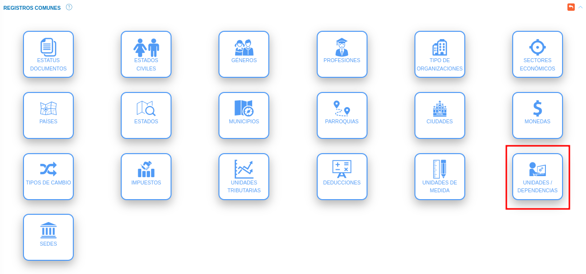
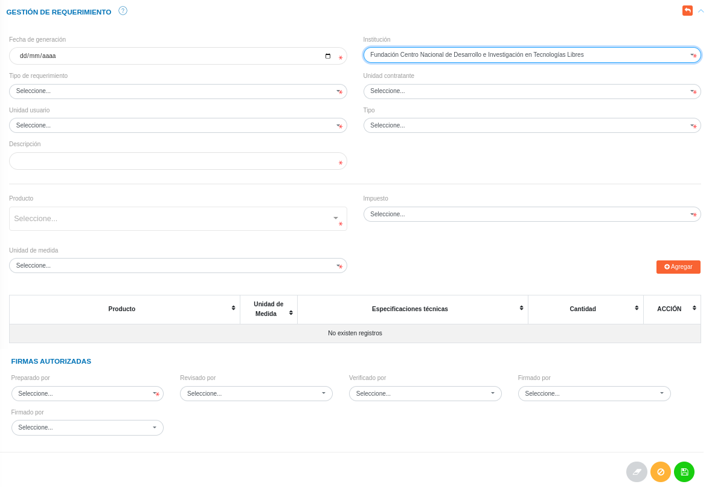
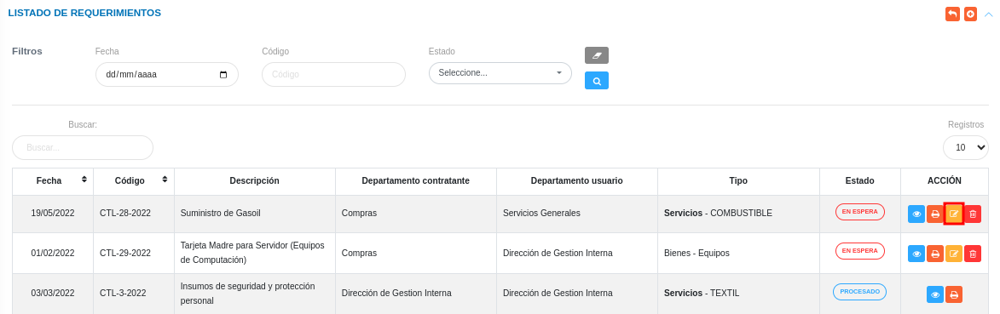
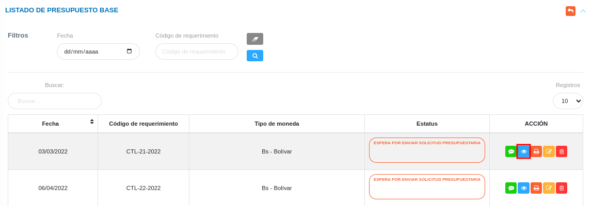
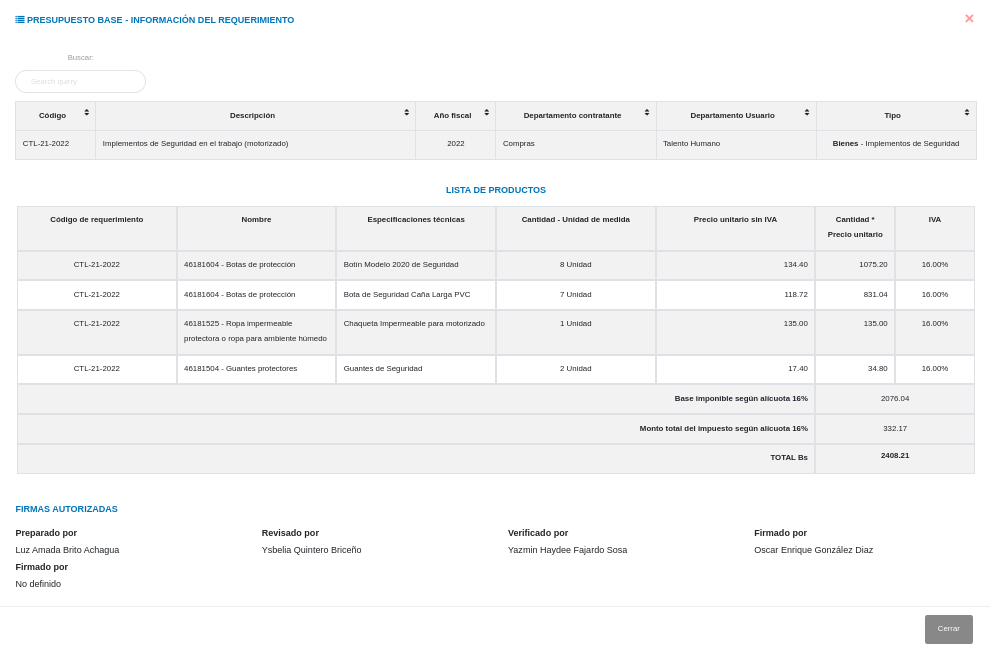

# Gestión de Requerimientos
***************************

El usuario selecciona el módulo de Compras en el menú lateral de los módulos del sistema, ahí visualizara las opciones **Configuración**, **Proveedores**, **Plan de compras**, **Requerimientos**, **Cotización**, **Disponibilidad Presupuestaria** y **Orden de compras**, debiendo pulsar **Requerimientos** 

Figura 31: Menú del Módulo de Compras

## Listado de Requerimientos 

A través de esta sección se lleva a cabo la gestión de requerimientos en el módulo de compras. Esta sección lista los registros de requerimientos con información relevante sobre cada uno de ellos, desde la tabla de registros es posible crear un nuevo registro o gestionar cualquier registro de requerimientos. 

Figura 32: Tabla de registros de los requerimientos

### Registrar requerimientos  

-   El usuario ingresará a la opción **Requerimiento**. Seguidamente el sistema presenta la sección **Listado de requerimientos**  
-   Haciendo uso del botón **Crear**  ubicado en la esquina superior derecha de esta sección(Figura 31 Tabla de registros de requerimientos), se procede a realizar un nuevo registro de plan de compras. 
-   El sistema despliega un formulario de requerimientos para completar los datos del mismo. 
- Complete el formulario de requerimientos. Tenga en consideración completar los campos obligatorios que son requeridos para el registro de un requerimiento de compras. 

Para agregar unidades o dependencias  acceda a **Configuración** > **General** > **Registros Comunes**. 

   

 Para agregar registros comunes del módulo de Compras acceda a **Compras** > **Configuración** > **Registros Comunes**. 

   

   -   ***Tipo***: Para crear un nuevo registro de objeto de proveedor de compras acceda a **Configuración** > **General** > **Registros Comunes** > **Objeto de Proveedor**. 
  

- Presione el botón **Guardar**   para registrar los cambios efectuados.
- Presione el botón **Cancelar**   para cancelar registro y regresar a la ruta anterior.
- Presione el botón **Borrar**  para eliminar datos del formulario.
- Si desea recibir ayuda guiada presione el botón .
- Para retornar a la ruta anterior presione el botón .

## Gestionar requerimiento

La gestión de requerimientos se lleva a cabo a través del apartado **Requerimientos**. 

-   Para acceder a esta sección debe dirigirse a **Compras** y ubicarse en la sección **Requerimientos** apartado **Listado de requerimientos** (ver Figura 32).

A través del apartado **Listado de requerimientos** se listan los registros de **Listado de requerimientos** en una tabla.   

Desde este apartado se pueden llevar a cabo las siguientes acciones: 

-   ***Registrar requerimientos***.   
-   ***Consultar registros***.
-   ***Imprimir Registro***. 
-   ***Editar registros***. 
-   ***Eliminar registros***. 

Figura 33: Requerimientos registrados

### Registrar requerimientos

-   Presione el botón **Crear registro**  ubicado en la parte superior derecha del apartado **Requerimientos** (ver Figura 33)
-   A continuación complete el formulario siguiendo los pasos descritos en el apartado [Registrar requerimientos](##Registrar-requerimientos).
-   Presione el botón **Guardar**   para registrar los cambios efectuados.

Figura 34: Registrar requerimientos

### Consultar registros

-   Presione el botón **Consultar registro**  ubicado en la columna titulada **Acción** de un registro de requerimientos que se prefiere consultar. 

Figura 35: Consultar Registros de requerimientos 

-   A continuación el sistema despliega una sección donde se describen los datos del requerimiento seleccionado.

Figura 36: Datos del requerimientos

### Imprimir registro

-   Presione el botón **Imprimir regristro**   ubicado en la columna titulada **Acción** del registro de plan de compras que se desee seleccionar para imprimir el reporte. 

Figura 37: Imprimir requerimiento

- El sistema presenta en un documento PDF, el archivo generado con el requerimiento. 

Figura 38: PDF del requerimiento

### Editar registros

-   Presione el botón **Editar registro**   ubicado en la columna titulada **Acción** del registro de requerimientos que se desee seleccionar para actualizar datos. 

Figura 39: Editar Registros de requerimientos

-   Actualice los datos del formulario siguiendo los pasos descritos en el apartado [Registrar requerimientos](#registrar-requerimientos).
-   Presione el botón **Guardar**   para registrar los cambios efectuados.

### Eliminar registros

-   Presione el botón **Eliminar registro**   ubicado en la columna titulada **Acción** del registro de requerimientos que se desee seleccionar para eliminar del sistema. 

Figura 40: Eliminar Registros de requerimientos

-   Confirme que esta seguro de eliminar el registro seleccionado a través de la ventana emergente, mediante el botón **Confirmar** y efectue los cambios.  

***************************

# Gestión de Presupuesto Base

## Listado de presupuesto base 

A través de esta sección se lleva a cabo la gestión de presupuesto base en el módulo de compras. Esta sección lista los registros de presupuestos bases asociados a un requerimiento con información relevante sobre cada uno de ellos, desde la tabla de registros es posible crear un nuevo registro o gestionar cualquier registro de presupuesto base. Esta funcionalidad depenede de la sección de requerimientos. 

Figura 41: Tabla de registros de los presupuesto base

### Registrar presupuesto base  

-   El usuario ingresará a la opción **Presupuesto Base**. Seguidamente el sistema presenta la sección **Listado de presupuesto base**  
-   Haciendo uso del botón **Completar**  ubicado en la columna acción de la tabla de registros de presupuesto base(Figura 41). 
-   El sistema despliega un formulario de requerimientos para completar los datos del mismo. 
- Complete el formulario de presupuesto base. Tenga en consideración completar los campos obligatorios que son requeridos para el registro de un requerimiento de compras. 

Para agregar Monedas  e Impuestos acceda a **Configuración** > **General** > **Registros Comunes**. 

   

 Para agregar personal o responsable acceda a **Talento Humano** > **Expediente** > **Datos Personales y Datos Laborales**. 

  

   -   ***Datos personales***: Para crear un nuevo registro de datos personales acceda a **Talento Humano** > **Expediente** > **Datos personales**.
   -   ***Datos laborales***: Para crear un nuevo registro de datos laborales acceda a **Talento Humano** > **Expediente** > **Datos laborales**

- Presione el botón **Guardar**   para registrar los cambios efectuados.
- Presione el botón **Cancelar**   para cancelar registro y regresar a la ruta anterior.
- Presione el botón **Borrar**  para eliminar datos del formulario.
- Si desea recibir ayuda guiada presione el botón .
- Para retornar a la ruta anterior presione el botón .

## Gestionar presupuesto base

La gestión de presupuesto base se lleva a cabo a través del apartado **Requerimientos**. 

-   Para acceder a esta sección debe dirigirse a **Compras** y ubicarse en la sección **Requerimientos** apartado **Listado de presupuesto base** (ver Figura 31).

A través del apartado **Listado de requerimientos** se listan los registros de **Listado de presupuesto base** en una tabla.   

Desde este apartado se pueden llevar a cabo las siguientes acciones: 

-   ***Completar presupuesto base***.   
-   ***Consultar registros***.
-   ***Imprimir Registro***. 
-   ***Editar registros***. 
-   ***Eliminar registros***. 

Figura 42: Presupuestos bases registrados

### Completar presupuesto base

-   Presione el botón **Completar**  ubicado en la columna acción de la tabla de registros de presupuesto base(Figura 40). 
-   A continuación complete el formulario siguiendo los pasos descritos en el apartado [Registrar presupuesto base](##Registrar-presupuesto_base).
-   Presione el botón **Guardar**   para registrar los cambios efectuados.

Figura 43: Registrar presupuesto base

### Consultar registros

-   Presione el botón **Consultar registro**  ubicado en la columna titulada **Acción** de un registro de presupuesto base que se prefiere consultar. 

Figura 44: Consultar Registros de presupuesto base 

-   A continuación el sistema despliega una sección donde se describen los datos del requerimiento seleccionado.

Figura 45: Datos del presupuesto base

### Imprimir registro

-   Presione el botón **Imprimir regristro**   ubicado en la columna titulada **Acción** del registro de presupuesto base que se desee seleccionar para imprimir el reporte. 

Figura 46: Imprimir presupuesto base

- El sistema presenta en un documento PDF, el archivo generado con el presupuesto base. 

Figura 47: PDF del presupuesto base

### Editar registros

-   Presione el botón **Editar registro**   ubicado en la columna titulada **Acción** del registro de presupuesto base que se desee seleccionar para actualizar datos. 

Figura 48: Editar Registros de presupuesto base

-   Actualice los datos del formulario siguiendo los pasos descritos en el apartado [Registrar presupuesto base](#registrar-presupuesto_base).
-   Presione el botón **Guardar**   para registrar los cambios efectuados.

### Eliminar registros

-   Presione el botón **Eliminar registro**   ubicado en la columna titulada **Acción** del registro de presupuesto base que se desee seleccionar para eliminar del sistema. 

Figura 49: Eliminar Registros de presupuesto base

-   Confirme que esta seguro de eliminar el registro seleccionado a través de la ventana emergente, mediante el botón **Confirmar** y efectue los cambios. 

