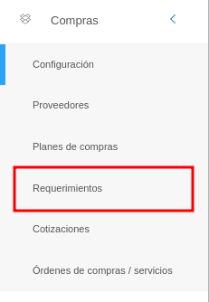
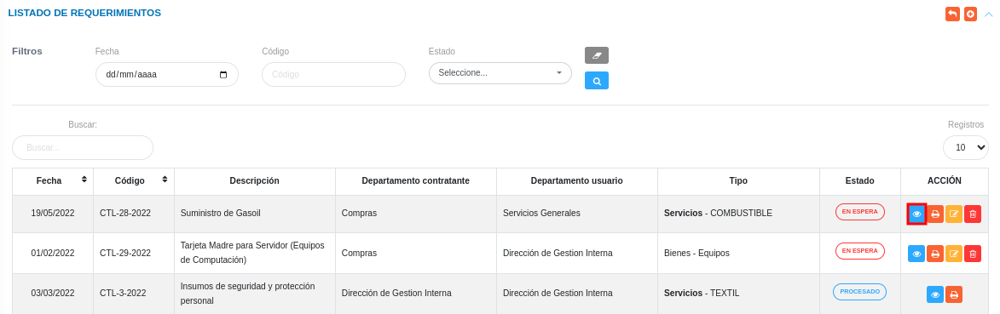
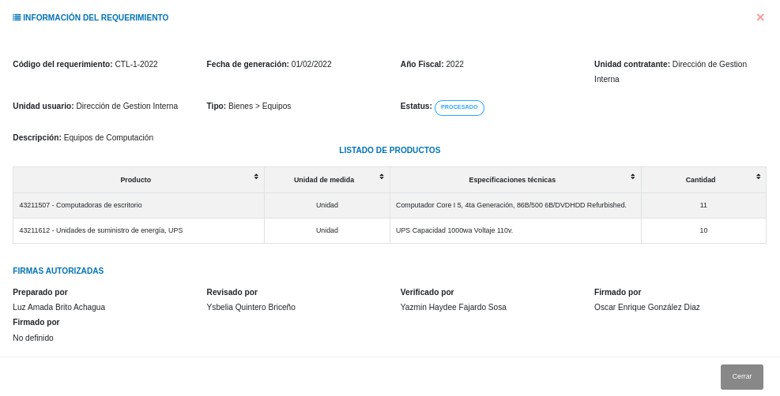
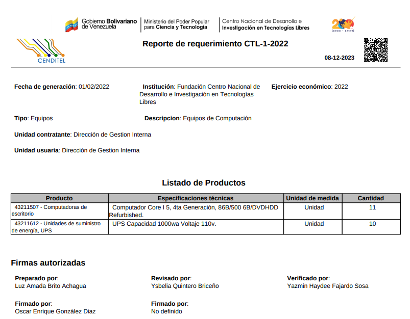
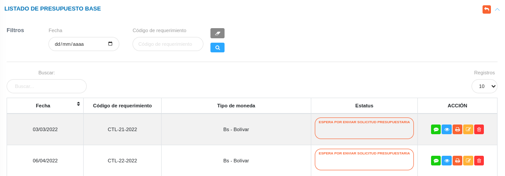
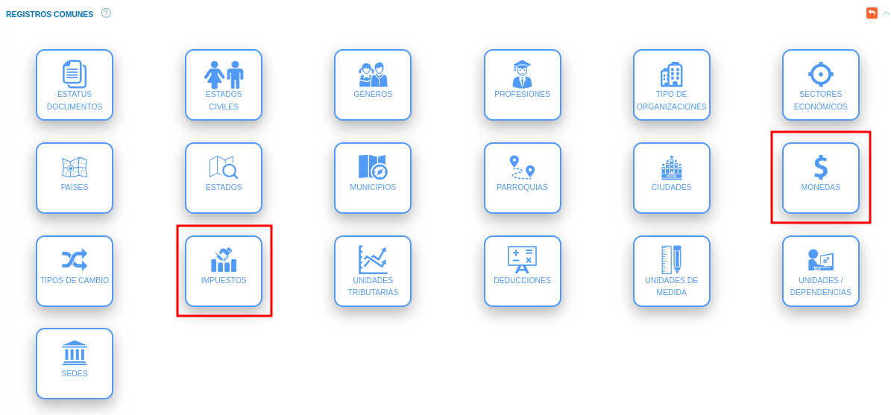
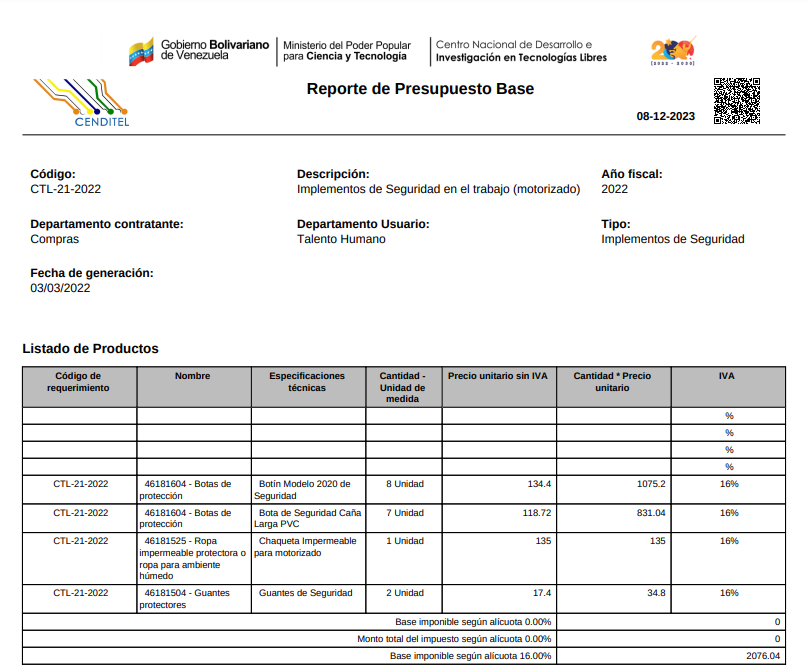

# Gestión de Requerimientos
***************************

El usuario selecciona el módulo de Compras en el menú lateral de los módulos del sistema, ahí visualizara las opciones **Configuración**, **Proveedores**, **Plan de compras**, **Requerimientos**, **Cotizaciones** y **Órdenes de compras/servicios**, debiendo pulsar **Requerimientos** 

Figura 1: Menú del Módulo de Compras

 

## Listado de Requerimientos 

A través de esta sección se lleva a cabo la gestión de requerimientos en el módulo de compras. Esta sección lista los registros de requerimientos con información relevante sobre cada uno de ellos. Desde la tabla de registros es posible crear un nuevo registro o gestionar cualquier registro de requerimientos. 

Figura 2: Tabla de registros de los requerimientos

 

### Registrar requerimientos  

-   El usuario ingresará a la opción **Requerimiento**. Seguidamente el sistema presenta la sección **Listado de requerimientos**  
-   Haciendo uso del botón **Crear**  ubicado en la esquina superior derecha de esta sección, se procede a realizar un nuevo registro de requerimiento. 
-   El sistema despliega un formulario de requerimientos para completar los datos del mismo. 
- Complete el formulario de requerimientos. Tenga en consideración completar los campos obligatorios que son requeridos para el registro de un requerimiento de compras. 

Para agregar unidades o dependencias  acceda a **Configuración** > **General** > **Registros Comunes**. 

   

 Para agregar registros comunes del módulo de Compras acceda a **Compras** > **Configuración** > **Registros Comunes**. 

   

   -   ***Tipo***: Para crear un nuevo registro de objeto de proveedor de compras acceda a **Configuración** > **General** > **Registros Comunes** > **Objeto de Proveedor**. 
  

- Presione el botón **Guardar**   para registrar los cambios efectuados.
- Presione el botón **Cancelar**   para cancelar registro y regresar a la ruta anterior.
- Presione el botón **Borrar**  para eliminar datos del formulario.
- Si desea recibir ayuda guiada presione el botón .
- Para retornar a la ruta anterior presione el botón .

## Gestionar requerimiento

La gestión de requerimientos se lleva a cabo a través del apartado **Requerimientos**. 

-   Para acceder a esta sección debe dirigirse a **Compras** y ubicarse en la sección **Requerimientos** apartado **Listado de requerimientos**.

A través del apartado **Listado de requerimientos** se listan los registros de **Listado de requerimientos** en una tabla.   

Desde este apartado se pueden llevar a cabo las siguientes acciones: 

-   ***Registrar requerimientos***.   
-   ***Consultar registros***.
-   ***Imprimir Registro***. 
-   ***Editar registros***. 
-   ***Eliminar registros***. 

Figura 3: Requerimientos registrados

 

### Registrar requerimientos

-   Presione el botón **Crear registro**  ubicado en la parte superior derecha del apartado **Requerimientos**.
-   A continuación complete el formulario siguiendo los pasos descritos en el apartado [Registrar requerimientos](##Registrar-requerimientos).
-   Presione el botón **Guardar**   para registrar los cambios efectuados.

Figura 4: Registrar requerimientos

 

### Consultar registros

-   Presione el botón **Consultar registro**  ubicado en la columna titulada **Acción** de un registro de requerimientos que se prefiere consultar. 

Figura 5: Consultar Registros de requerimientos 

 

-   A continuación el sistema despliega una sección donde se describen los datos del requerimiento seleccionado.

Figura 6: Datos del requerimientos

 

### Imprimir registro

-   Presione el botón **Imprimir registro**  ubicado en la columna titulada **Acción** del registro de plan de compras que se desee seleccionar para imprimir el reporte. 

Figura 7: Imprimir requerimiento

 

- El sistema presenta en un documento PDF, el archivo generado con el requerimiento. 

Figura 8: PDF del requerimiento

 

### Editar registros

-   Presione el botón **Editar registro**   ubicado en la columna titulada **Acción** del registro de requerimientos que se desee seleccionar para actualizar datos. 

Figura 9: Editar Registros de requerimientos

 

-   Actualice los datos del formulario siguiendo los pasos descritos en el apartado [Registrar requerimientos](#registrar-requerimientos).
-   Presione el botón **Guardar**   para registrar los cambios efectuados.

### Eliminar registros

-   Presione el botón **Eliminar registro**   ubicado en la columna titulada **Acción** del registro de requerimientos que se desee seleccionar para eliminar del sistema. 

Figura 10: Eliminar Registros de requerimientos

 

-   Confirme que está seguro de eliminar el registro seleccionado a través de la ventana emergente, mediante el botón **Confirmar**.  

***************************

# Gestión de Presupuesto Base

## Listado de presupuesto base 

A través de esta sección se lleva a cabo la gestión de presupuesto base en el módulo de compras. Esta sección lista los registros de presupuestos base asociados a un requerimiento con información relevante sobre cada uno de ellos. Desde la tabla de registros es posible crear un nuevo registro o gestionar cualquier registro de presupuesto base. Esta funcionalidad depende de la sección de **Requerimientos**. 

Figura 11: Tabla de registros de los presupuesto base

 

### Registrar presupuesto base  

-   El usuario ingresará a la opción **Presupuesto Base**. Seguidamente el sistema presenta la sección **Listado de presupuesto base**  
-   Haciendo uso del botón **Completar**  ubicado en la columna acción de la tabla de registros de presupuesto base. 
-   El sistema despliega un formulario de requerimientos para completar los datos del mismo. 
- Complete el formulario de presupuesto base. Tenga en consideración completar los campos obligatorios que son requeridos para el registro de un requerimiento de compras. 

Para agregar Monedas e Impuestos acceda a **Configuración** > **General** > **Registros Comunes**. 

   

 Para agregar personal o responsable acceda a **Talento Humano** > **Expediente** > **Datos Personales y Datos Laborales**. 

  

   -   ***Datos personales***: Para crear un nuevo registro de datos personales acceda a **Talento Humano** > **Expediente** > **Datos personales**.
   -   ***Datos laborales***: Para crear un nuevo registro de datos laborales acceda a **Talento Humano** > **Expediente** > **Datos laborales**

- Presione el botón **Guardar**   para registrar los cambios efectuados.
- Presione el botón **Cancelar**   para cancelar registro y regresar a la ruta anterior.
- Presione el botón **Borrar**  para eliminar datos del formulario.
- Si desea recibir ayuda guiada presione el botón .
- Para retornar a la ruta anterior presione el botón .

## Gestionar presupuesto base

La gestión de presupuesto base se lleva a cabo a través del apartado **Requerimientos**. 

-   Para acceder a esta sección debe dirigirse a **Compras** y ubicarse en la sección **Requerimientos** apartado **Listado de presupuesto base**.

A través del apartado **Listado de requerimientos** se listan los registros de **Listado de presupuesto base** en una tabla.   

Desde este apartado se pueden llevar a cabo las siguientes acciones: 

-   ***Solicitar disponibilidad presupuestaria***.   
-   ***Consultar registros***.
-   ***Imprimir Registro***. 
-   ***Editar registros***. 
-   ***Eliminar registros***. 

Figura 12: Presupuestos bases registrados

 

### Solicitar disponibilidad presupuestaria

-   Presione el botón **Solicitar**  ubicado en la columna titulada **Acción** de la tabla de registros de presupuesto base.
-   A continuación complete el formulario con los datos del usuario y el mensaje correspondiente.
-   Presione el botón **Enviar**   para confirmar la solicitud.

Figura 13: Solicitar disponibilidad presupuestaria

 

### Consultar registros

-   Presione el botón **Consultar registro**  ubicado en la columna titulada **Acción** de un registro de presupuesto base que se prefiere consultar. 

Figura 14: Consultar Registros de presupuesto base 

 

-   A continuación el sistema despliega una sección donde se describen los datos del requerimiento seleccionado.

Figura 15: Datos del presupuesto base

 

### Imprimir registro

-   Presione el botón **Imprimir registro**   ubicado en la columna titulada **Acción** del registro de presupuesto base que se desee seleccionar para imprimir el reporte. 

Figura 16: Imprimir presupuesto base

 

- El sistema presenta en un documento PDF, el archivo generado con el presupuesto base. 

Figura 17: PDF del presupuesto base

 

### Editar registros

-   Presione el botón **Editar registro**   ubicado en la columna titulada **Acción** del registro de presupuesto base que se desee seleccionar para actualizar datos. 

Figura 18: Editar Registros de presupuesto base

 

-   Actualice los datos del formulario siguiendo los pasos descritos en el apartado [Registrar presupuesto base](#registrar-presupuesto_base).
-   Presione el botón **Guardar**   para registrar los cambios efectuados.

### Eliminar registros

-   Presione el botón **Eliminar registro**   ubicado en la columna titulada **Acción** del registro de presupuesto base que se desee seleccionar para eliminar del sistema. 

Figura 19: Eliminar Registros de presupuesto base

 

-   Confirme que esta seguro de eliminar el registro seleccionado a través de la ventana emergente, mediante el botón **Confirmar**. 

