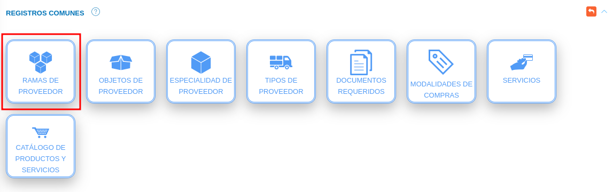
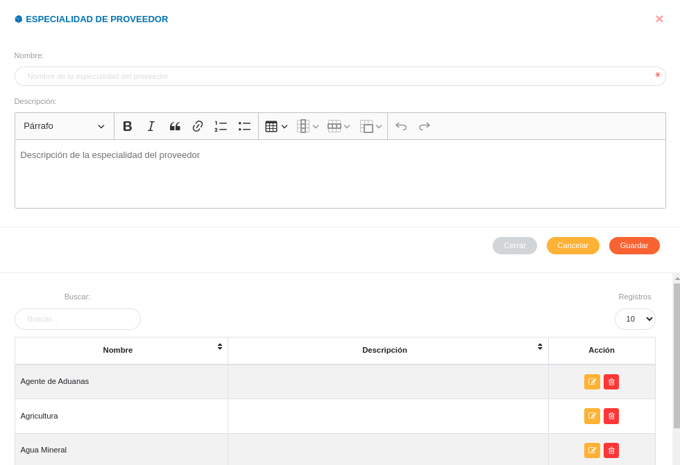
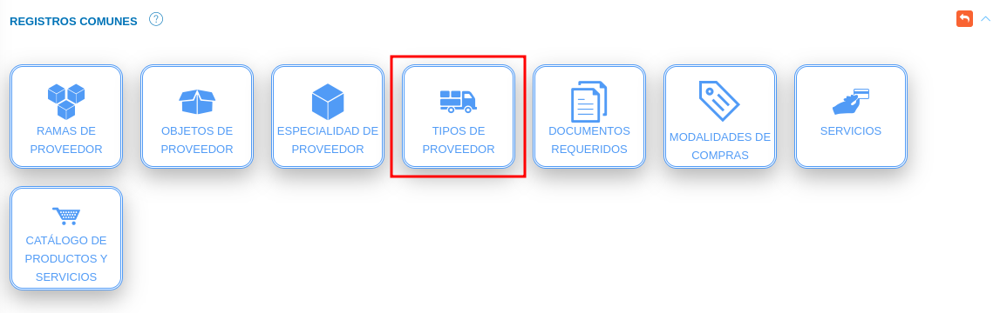
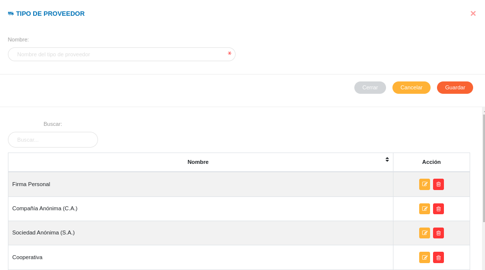
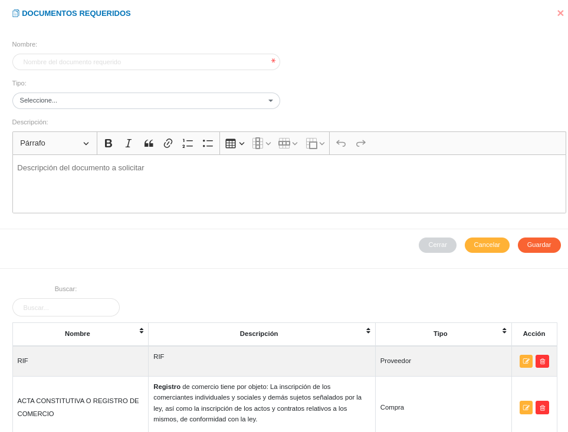
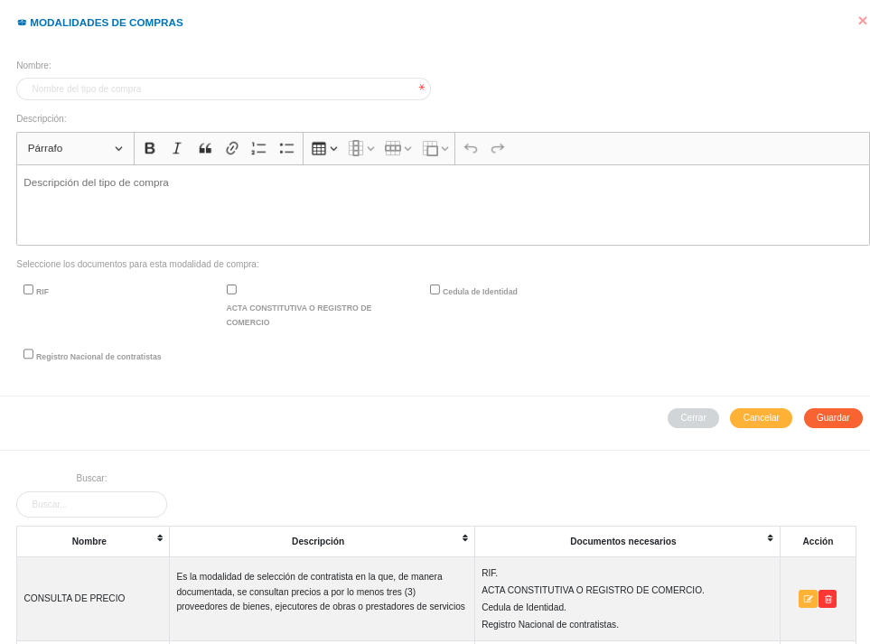

# Configuración Módulo de Compras
*********************************

El usuario selecciona el módulo de Compras en el menú lateral de los módulos del sistema, ahí visualizara las opciones **Configuración**, **Proveedores**, **Plan de compras**, **Requerimientos**, **Cotización**, **Disponibilidad Presupuestaria** y **Orden de compras**, debiendo pulsar **Configuración** 

Figura 3: Menú del Módulo de Compras

## Registros Comunes

La sección de registros comunes es una herramienta de la **Configuración del Módulo de Compras** que permite al administrador o un usuario con permisos especiales sobre el módulo de compras, ajustar el módulo a la organización usuaria a través de parámetros configurables.   Los datos registrados en esta sección serán considerados en todas las funcionalidades del módulo.

El usuario ingresará a **Registros Comunes**, visualizando 6 iconos **Ramas de Proveedor**, **Objetos de Proveedor**,**Especialidades de Proveedor**, **Tipos de Proveedor**, **Documentos Requeridos** y **Modalidades de Compra**.

Figura 4: Registros Comunes del Módulo de Compras

### Ramas de Proveedor

A través de esta funcionalidad se gestiona información sobre las diferentes ramas a las que un proveedor puede estar asociado. Los registros realizados en esta sección corresponden a datos a incluir en la información básica de un proveedor en la gestión de proveedores del módulo de compras.   

El usuario selecciona el icono **Ramas de proveedor**. 

***Registro de rama de proveedor***

-   Complete el formulario **Rama de Proveedor** (ver Figura 4).   Asigne un nombre y descripción para la rama del proveedor a través de los campos **Nombre** y **Descripción**.
-   Presione el botón  **Guardar** para registrar los cambios efectuados.
-   Presione el botón  **Cancelar** para limpiar datos del formulario.
-   Presione el botón  **Cerrar** para cerrar el formulario.

Figura 4:  Formulario para registrar una rama de proveedor

***Gestión de registros de rama de proveedor***

-   Para editar un registro de **Rama de Proveedor** presione el botón **Editar**  del registro seleccionado de la tabla **Registros**.  A continuación complete el formulario **Rama de proveedor** y presione el botón **Guardar** para almacenar los cambios efectuados.
-   Para eliminar un registro de **Rama de proveedor** presione el botón **Eliminar**  del registro seleccionado de la tabla **Registros**. 

### Objetos de Proveedor

A través de esta funcionalidad se gestiona información sobre los diferentes objetos asociados al servicio que presta un proveedor.  Los registros realizados en esta sección corresponden a datos a incluir en la información básica de los proveedores.   

El usuario selecciona el icono **Objetos de proveedor**. 

***Registro de objetos de proveedor***

-   Complete el formulario **Objetos de Proveedor** (ver Figura 5).   Asigne un tipo, nombre y descripción para el objeto del proveedor a través de los campos **Tipo**, **Nombre** y **Descripción**.
-   Presione el botón  **Guardar** para registrar los cambios efectuados.
-   Presione el botón  **Cancelar** para limpiar datos del formulario.
-   Presione el botón  **Cerrar** para cerrar el formulario.

Figura 5: Formulario para registrar un objeto de proveedor

***Gestión de registros de objetos de proveedor***

-   Para editar un registro de **Objetos de Proveedor** presione el botón **Editar**  del registro seleccionado de la tabla **Registros**.  A continuación complete el formulario **Objetos de proveedor** y presione el botón **Guardar** para almacenar los cambios efectuados.
-   Para eliminar un registro de **Objetos de proveedor** presione el botón **Eliminar**  del registro seleccionado de la tabla **Registros**. 

### Especialidad de Proveedor

A través de esta funcionalidad se gestiona información sobre las diferentes especialidades a las que un proveedor puede estar asociado.  Los registros realizados en esta sección corresponden a datos a incluir en la información básica de un proveedor en la gestión de proveedores del módulo de compras.   

El usuario selecciona el icono **Especialidad de proveedor**. 

***Registro de especialidad de proveedor***

-   Complete el formulario **Especialidad de Proveedor** (ver Figura 6).   Asigne un nombre y descripción para la especialidad del proveedor a través de los campos **Nombre** y **Descripción**. 
-   Presione el botón  **Guardar** para registrar los cambios efectuados.
-   Presione el botón  **Cancelar** para limpiar datos del formulario.
-   Presione el botón  **Cerrar** para cerrar el formulario.

Figura 6: Formulario para registrar una especialidad de proveedor

***Gestión de registros de especialidad de proveedor***

-   Para editar un registro de **Especialidad de Proveedor** presione el botón **Editar**  del registro seleccionado de la tabla **Registros**.  A continuación complete el formulario **Especialidad de proveedor** y presione el botón **Guardar** para almacenar los cambios efectuados.
-   Para eliminar un registro de **Especialidad de proveedor** presione el botón **Eliminar**  del registro seleccionado de la tabla **Registros**. 

### Tipos de Proveedor

A través de esta funcionalidad se gestiona información sobre los diferentes tipos de proveedores a gestionar.  Los registros realizados en esta sección corresponden a datos a incluir en la información básica de un proveedor en la gestión de proveedores del módulo de compras.   

El usuario selecciona el icono **Tipos de proveedor**. 

***Registro de tipo de proveedor***

-   Complete el formulario **Tipo de Proveedor** (ver Figura 7).   Asigne un nombre para el tipo del proveedor a través del campo **Nombre**. 
-   Presione el botón  **Guardar** para registrar los cambios efectuados.
-   Presione el botón  **Cancelar** para limpiar datos del formulario.
-   Presione el botón  **Cerrar** para cerrar el formulario.

Figura 7: Formulario para registrar un tipo de proveedor

***Gestión de registros de tipo de proveedor***

-   Para editar un registro de **tipo de Proveedor** presione el botón **Editar**  del registro seleccionado de la tabla **Registros**.  A continuación complete el formulario **tipo de proveedor** y presione el botón **Guardar** para almacenar los cambios efectuados.
-   Para eliminar un registro de **tipo de proveedor** presione el botón **Eliminar**  del registro seleccionado de la tabla **Registros**. 

### Documentos Requeridos

A través de esta funcionalidad se gestionan los tipos de documentos a consignar o solicitar para registro de proveedores y la gestión de ordenes de compras.  Los registros realizados en esta sección corresponden a campos habilitados en los formularios de registro en la gestión de proveedores y gestión de orden de compras del módulo de compras.   

El usuario selecciona el icono **Documentos Requeridos**. 

***Registro de documentos requeridos***

-   Complete el formulario **Documentos Requeridos** (ver Figura 8).   Asigne un nombre, tipo y descripción para el documento requerido a través de los campos **Nombre**, **Tipo** y **Descripción**. 
-   Presione el botón  **Guardar** para registrar los cambios efectuados.
-   Presione el botón  **Cancelar** para limpiar datos del formulario.
-   Presione el botón  **Cerrar** para cerrar el formulario.

Figura 8: Formulario para registrar un documento requerido

***Gestión de registros de documentos requeridos***

-   Para editar un registro de **documentos requeridos** presione el botón **Editar**  del registro seleccionado de la tabla **Registros**.  A continuación complete el formulario **documentos requeridos** y presione el botón **Guardar** para almacenar los cambios efectuados.
-   Para eliminar un registro de **documentos requeridos** presione el botón **Eliminar**  del registro seleccionado de la tabla **Registros**. 

### Modalidades de compra

A través de esta funcionalidad se gestionan las diferentes modalidades de compras a emplear por la organización.  Cada modalidad incluye un listado de documentos requeridos que pueden ser seleccionados. Los registros realizados en esta sección corresponden a campos habilitados en el formulario registro de la gestión de orden de compras del módulo de compras

El usuario selecciona el icono **Modalidades de Compras**. 

***Registro de modalidades de compra***

-   Complete el formulario **Modalidades de Compra** (ver Figura 9).   Asigne un nombre y descripción para la modalidad de compra a través de los campos **Nombre** y **Descripción**, seguidamente seleccione los documentos asociados a esa modalidad de compra.
-   Presione el botón  **Guardar** para registrar los cambios efectuados.
-   Presione el botón  **Cancelar** para limpiar datos del formulario.
-   Presione el botón  **Cerrar** para cerrar el formulario.

Figura 9: Formulario para registrar  modalidades de compras

!!! info "Formulario de registro"
    -  **Seleccione los documentos para esta modalidad de compra**
    
    Para seleccionar cualquiera de los documentos a consignar se debe seleccionar con un clic los botones checkbox. 

***Gestión de registros de modalidades de compras***

-   Para editar un registro de **modalidades de compras** presione el botón **Editar**  del registro seleccionado de la tabla **Registros**.  A continuación complete el formulario **modalidades de compras** y presione el botón **Guardar** para almacenar los cambios efectuados.
-   Para eliminar un registro de **modalidades de compras** presione el botón **Eliminar**  del registro seleccionado de la tabla **Registros**. 

