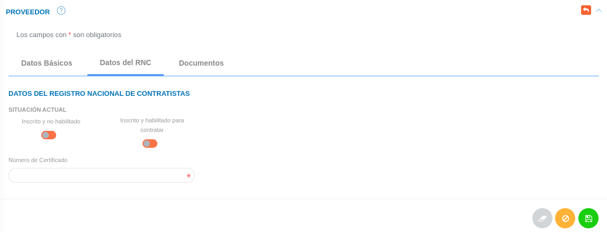
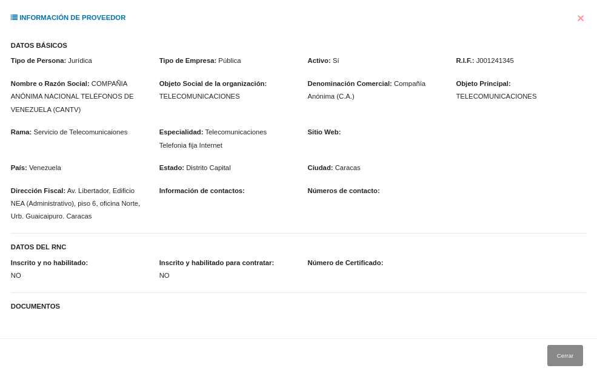
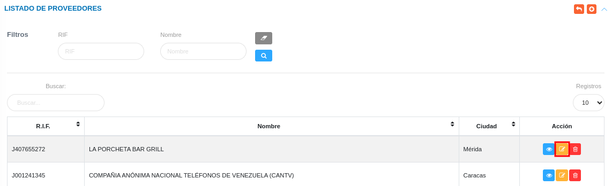
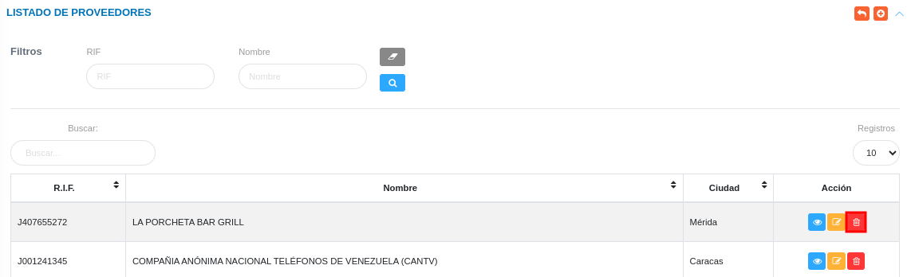

# Gestión de Proveedores
************************

El usuario selecciona el módulo de Compras en el menú lateral de los módulos del sistema, ahí visualizara las opciones **Configuración**, **Proveedores**, **Plan de compras**, **Requerimientos**, **Cotización**, **Disponibilidad Presupuestaria** y **Orden de compras**, debiendo pulsar **Proveedores** 

Figura 10: Menú del Módulo de Compras

## Proveedores

A través de esta sección se lleva a cabo la gestión de proveedores en el módulo de compras. Esta sección lista los registros de proveedores con información relevante sobre cada uno de ellos, desde la tabla de registros es posible crear un nuevo registro o gestionar cualquier registro de proveedor.  

Figura 11: Tabla de registros de los proveedores

### Registrar proveedor 

-   El usuario ingresará a la opción **Proveedores** 
-   Haciendo uso del botón **Crear**  ubicado en la esquina superior derecha de esta sección(Figura Tabla de registros de proveedores), se procede a realizar un nuevo registro de proveedor.
-   El sistema despliega un formulario de proveedores, en el cual se debera llenar las tres secciones del formulario.

###  Datos básicos

- Complete el formulario del apartado **Datos Básicos**. Tenga en consideración completar los campos obligatorios que son requeridos para el registro de un proveedor.

!!! note "Nota" 
    Los campos de selección del apartado **Datos básicos** incluyen información configurada previamente a través de los registros comunes del módulo de compras y del sistema. Si se requiere incluir información diferente a la que se encuentra por defecto, se recomienda agregar estos registros en la configuración de registros comunes. 

 Para agregar registros comunes del sistema acceda a **Configuración** > **General** > **Registros Comunes**. 

   

   -   ***País***: Para crear un nuevo registro de país acceda a **Configuración** > **General** > **Registros Comunes** > **Países**. 
   -   ***Estado***: Para crear un nuevo registro de estado acceda a **Configuración** > **General** > **Registros Comunes** > **Estados**. 
   -   ***Municipio***: Para crear un nuevo registro de municipio acceda a **Configuración** > **General** > **Registros Comunes** > **Municipios**. 
   -   ***Ciudad***: Para crear un nuevo registro de ciudad acceda a **Configuración** > **General** > **Registros Comunes** > **Ciudades**.

Para agregar registros comunes del módulo de Compras acceda a **Compras** > **Configuración** > **Registros Comunes**. 

   

   -   ***Denominación Comercial***: Para crear un nuevo registro de denominación comercial de proveedor acceda a **Configuración** > **General** > **Registros Comunes** > **Tipo de Proveedor**. 
   -   ***Objeto Principal***: Para crear un nuevo registro de objeto principal de proveedor acceda a **Configuración** > **General** > **Registros Comunes** > **Objetos de Proveedor**. 
   -   ***Rama***: Para crear un nuevo registro de rama de proveedor acceda a **Configuración** > **General** > **Registros Comunes** > **Rama del proveedor**. 
   -   ***Especialidad***: Para crear un nuevo registro de especialidad de proveedor acceda a **Configuración** > **General** > **Registros Comunes** > **Especialidad de proveedor**.

Figura 12: Proveedores-Datos Básicos 

###  Datos del RNC

- Complete el formulario del apartado **Datos del RNC**. Tenga en consideración completar los campos obligatorios que son requeridos para el registro de un proveedor.

Figura 13:  Proveedores-Datos Básicos Datos del RNC (Datos del Registro Nacional de Contratistas)

###  Documentos 

- Complete el formulario del apartado **Documentos**. Tenga en consideración completar los campos obligatorios que son requeridos para el registro de un proveedor.

Figura 14:  Proveedores-Documentos 

!!! info "Datos del formulario de proveedores sección documentos"
    -   Cada documento solicitado en esta sección corresponde a un documento registrado en la **Configuración General** del módulo de **Compras** como documento a solicitar para el registro de proveedores.
    -   Para registrar un documento presione el botón **Cargar** 
    
    -   Para descargar un documento presione el botón **Descargar**
      

- Presione el botón **Guardar**   para registrar los cambios efectuados.
- Presione el botón **Cancelar**   para cancelar registro y regresar a la ruta anterior.
- Presione el botón **Borrar**  para eliminar datos del formulario.
- Si desea recibir ayuda guiada presione el botón .
- Para retornar a la ruta anterior presione el botón .

## Gestionar proveedores

La gestión de proveedores se lleva a cabo a través del apartado **Proveedores**. 

-   Para acceder a esta sección debe dirigirse a **Compras** y ubicarse en la sección **Proveedores** apartado **Proveedores** (ver Figura 15).

A través del apartado **Proveedores** se listan los registros de **Proveedores** en una tabla.   

Desde este apartado se pueden llevar a cabo las siguientes acciones: 

-   ***Registrar proveedores***.   
-   ***Consultar registros***.
-   ***Editar registros***. 
-   ***Eliminar registros***. 

Figura 15: Proveedores Registrados

### Registrar proveedor

-   Presione el botón **Crear registro**  ubicado en la parte superior derecha del apartado **Proveedores** (ver Figura 11)
-   A continuación complete el formulario siguiendo los pasos descritos en el apartado [Registrar proveedor](##datos-básicos).
-   Presione el botón **Guardar**   para registrar los cambios efectuados.

Figura 16: Registrar Proveedores

### Consultar registros

-   Presione el botón **Consultar registro**  ubicado en la columna titulada **Acción** de un registro de proveedor que se prefiere consultar. 

Figura 17: Consultar Registros de proveedores 

-   A continuación el sistema despliega una sección donde se describen los datos del proveedor seleccionado. 

Figura 18: Datos del proveedor

### Editar registros

-   Presione el botón **Editar registro**   ubicado en la columna titulada **Acción** del registro de proveedor que se desee seleccionar para actualizar datos. 

Figura 19: Editar Registros de Proveedores

-   Actualice los datos del formulario siguiendo los pasos descritos en el apartado [Registrar proveedor](#datos-básicos).
-   Presione el botón **Guardar**   para registrar los cambios efectuados.

### Eliminar registros

-   Presione el botón **Eliminar registro**   ubicado en la columna titulada **Acción** del registro de proveedor que se desee seleccionar para eliminar del sistema. 

Figura 20: Eliminar Registros de Proveedores

-   Confirme que esta seguro de eliminar el registro seleccionado a través de la ventana emergente, mediante el botón **Confirmar** y efectue los cambios. 