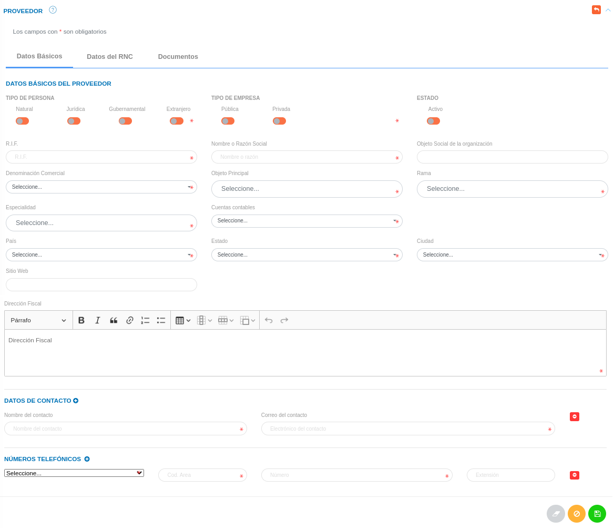
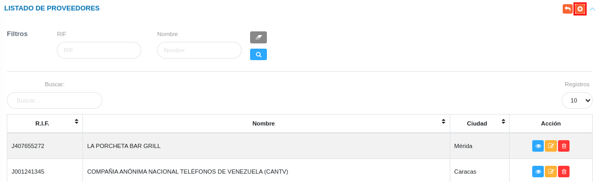

# Gestión de Proveedores
************************

El usuario selecciona el módulo de Compras en el menú lateral de los módulos del sistema, ahí visualizará las opciones **Configuración**, **Proveedores**, **Planes de compras**, **Requerimientos**, **Cotizaciones** y **Órdenes de compras/Servicio**, debiendo pulsar **Proveedores** 

Figura 1: Menú del Módulo de Compras

 

## Proveedores

A través de esta sección se lleva a cabo la gestión de proveedores en el módulo de compras. Esta sección lista los registros de proveedores con información relevante sobre cada uno de ellos. Desde la tabla de registros es posible crear un nuevo registro o gestionar cualquier registro de proveedor.  

Figura 2: Tabla de registros de proveedores

### Registrar proveedor 

-   El usuario ingresará a la opción **Proveedores** 
-   Haciendo uso del botón **Crear**  ubicado en la esquina superior derecha, se procede a realizar un nuevo registro de proveedor.
-   El sistema despliega un formulario de proveedores, en el cual se deberá transcribir: **Datos básicos**, **Datos del RNC** y **Documentos**.

###  Datos básicos

- Complete el formulario del apartado **Datos Básicos**. Tenga en consideración completar los campos obligatorios que son requeridos para el registro de un proveedor.

**Nota**: Los campos de selección del apartado **Datos básicos** incluyen información configurada previamente a través de los registros comunes del módulo de compras y del sistema. Si se requiere incluir información diferente a la que se encuentra por defecto, se recomienda agregar estos registros en la configuración de **Registros comunes**. 

Figura 3: Formulario de Datos Básicos de Proveedores

###  Datos del RNC

- Complete el formulario del apartado **Datos del RNC** (Registro Nacional de Contratistas). Tenga en consideración completar los campos obligatorios que son requeridos para el registro de un proveedor.

Figura 4:  Formulario de Datos del RNC

###  Documentos 

- Complete el formulario del apartado **Documentos**. Tenga en consideración completar los campos obligatorios que son requeridos para el registro de un proveedor.

Figura 5:  Documentos de proveedores 

 

**Nota:** Cada documento solicitado en esta sección corresponde a un documento registrado en la **Configuración General** del módulo de **Compras** como documento a solicitar para el registro de proveedores.

-   Para registrar un documento presione el botón **Cargar** .
-   Para descargar un documento presione el botón **Descargar** .

**Gestión de registros**

- Presione el botón **Guardar**   para registrar los cambios efectuados.
- Presione el botón **Cancelar**   para cancelar registro y regresar a la ruta anterior.
- Presione el botón **Borrar**  para eliminar datos del formulario.
- Si desea recibir ayuda guiada presione el botón .
- Para retornar a la ruta anterior presione el botón .

## Gestionar proveedores

La gestión de proveedores se lleva a cabo a través del apartado **Proveedores**. 

-   Para acceder a esta sección debe dirigirse a **Compras** y ubicarse en la sección **Proveedores** apartado **Proveedores**.
-   En el apartado **Proveedores** se listan los registros de **Proveedores** en una tabla.   

Desde este apartado se pueden llevar a cabo las siguientes acciones: 

-   ***Registrar proveedores***.   
-   ***Consultar registros***.
-   ***Editar registros***. 
-   ***Eliminar registros***. 

Figura 6: Registro de Proveedores

### Registrar proveedor

-   Presione el botón **Crear registro**  ubicado en la parte superior derecha del apartado **Proveedores**.
-   A continuación complete el formulario siguiendo los pasos descritos en el apartado [Registrar proveedor](##datos-básicos).
-   Presione el botón **Guardar**   para registrar los cambios efectuados.

Figura 7: Registrar Proveedores

### Consultar registros

-   Presione el botón **Consultar registro**  ubicado en la columna titulada **Acción** del registro de proveedor que se desea consultar. 

Figura 8: Consultar Registros de proveedores 

 

-   A continuación el sistema despliega una sección donde se describen los datos del proveedor seleccionado: 

Figura 9: Datos del proveedor

### Editar registros

-   Presione el botón **Editar registro**  ubicado en la columna titulada **Acción** del registro de proveedor que se desea actualizar. 

Figura 10: Editar Registros de Proveedores

 

-   Actualice los datos del formulario siguiendo los pasos descritos en el apartado [Registrar proveedor](#datos-básicos).
-   Presione el botón **Guardar**   para registrar los cambios efectuados.

### Eliminar registros

-   Presione el botón **Eliminar registro**  ubicado en la columna titulada **Acción** del registro de proveedor que se desea eliminar. 

Figura 11: Eliminar Registros de Proveedores

 

-   Confirme que está seguro de eliminar el registro seleccionado a través de la ventana emergente, mediante el botón **Confirmar**. 
