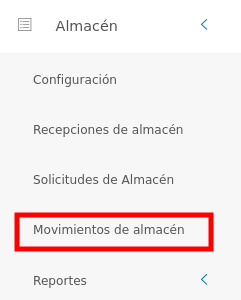
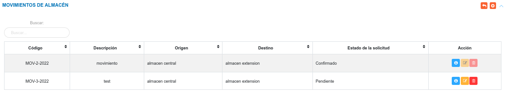
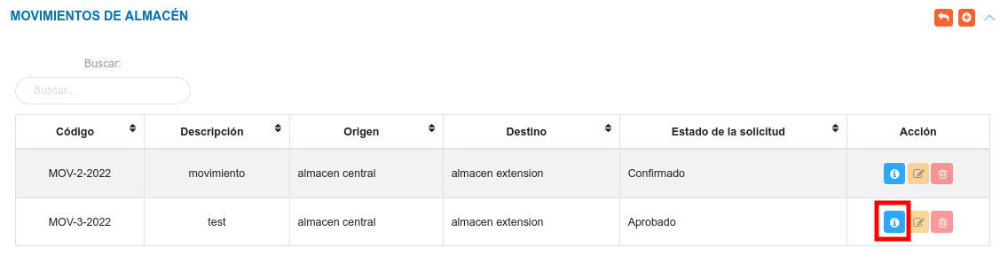
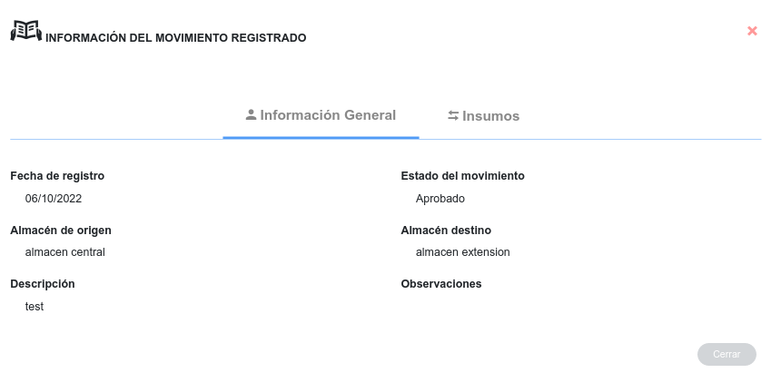
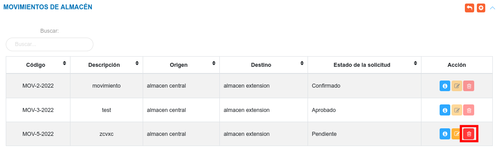
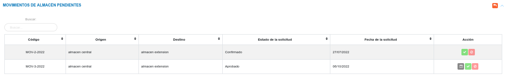

# Gestión de Movimientos en Almacén 
***********************************

## Movimientos de almacén

Para acceder a esta funcionalidad, el usuario se dirige al menú lateral y se ubica en el módulo de almacén, luego debe pulsar la opción **Movimientos de almacén**, seguidamente el sistema muestra el panel central compuesto por las secciones **Movimientos de Almacén** y **Movimientos de Almacén Pendientes**.

Figura: Movimientos de Almacén

En la sección de **Movimientos de Almacén**, el sistema lista todos los registros realizados de movimientos o traspasos de artículos entre almacenes. Desde esta sección también es posible **Crear** un nuevo registro, **Ver** información detallada del registro, **Editar** y **Eliminar** un registro. 

Figura: Movimientos de Almacén

!!! warning "Advertencia"
	Recuerden que la funcionalidad de movimientos de almacén se activa, sólo si el usuario la habilita en la configuración del módulo.  

### Crear una nueva solicitud

Mediante esta funcionalidad se registra una nueva solicitud para traspaso de productos entre almacenes. 

**Para crear una nueva solicitud**

- Dirigirse al módulo de **Almacén**, luego a **Movimientos de Almacén** y ubicarse en la sección **Movimientos de Almacén**.
- Haciendo uso del botón **Crear** 
ubicado en la esquina superior derecha de esta sección, se procede a realizar una nueva solicitud.
- Se completa el formulario de registro de la sección **Nuevo Movimiento de Almacén**. 
- Se presiona el botón **Guardar**  ubicado al final de esta sección, y se verifica en la lista de registros en **Movimientos de Almacén**.
- Se Presiona el botón **Cancelar**   para cancelar registro y regresar a la ruta anterior.
- Se Presiona el botón **Borrar**  para eliminar datos del formulario.
- Si desea recibir ayuda guiada presione el botón .
- Para retornar a la ruta anterior presione el botón .

Figura: Nuevo Movimiento de Almacén

!!! warning "Advertencia"
	El usuario analista de almacén debe ser cuidadoso a la hora de registrar un movimiento, puesto que debe tomar en consideración el número de existencia y el número de reserva que posee el insumo. Si se indica una cantidad mayor a la existencia del insumo,  el sistema generará emite un mensaje indicando que no se puede completar la acción.  

	

	**Consultar número de reserva y existencia del producto**

	Una vez se ingresa al formulario de **Nuevo Movimiento de Almacén** y se selecciona un almacén, cada **Insumo** indica información sobre su existencia y reserva en la columna titulada **Inventario**.

	

### Gestión de registros

Para **Ver información detallada**, **Editar** o **Eliminar** un registro se debe hacer uso de los botones ubicados en la columna titulada **Acción** de la tabla de registros en la sección de **Movimientos de Almacén**.  

#### Consultar registros

- Presione el botón **Consultar registro**  para un registro de interés. 

Figura: Consultar registros de movimientos de almacén 

- Seguidamente, el sistema muestra una interfaz con la información ingresada previamente del registro de almacén.

Figura: Datos del registro de movimiento de almacén

#### Editar registros

- Presione el botón **Editar registro**  para un registro de interés.
- Luego, el sistema muestra el formulario en forma de edición.
- Modifique la información que requiera.
- Presione el botón **Guardar**   para registrar los cambios efectuados.

#### Eliminar registros

- Presione el botón **Eliminar**   para un registro de interés.

Figura: Eliminar Registros de ingreso de almacén

- Seguidamente, el sistema presenta un modal con un mensaje de confirmación de si está seguro de eliminar el movimiento de almacén, y muestra los botones Confirmar y Cancelar.
- Pulse el botón **Confirmar** si está seguro de eliminar el registro seleccionado.
- El sistema elimina el registro.
- Si pulsa el botón **Cancelar**, el sistema no ejecuta ninguna acción. 

## Movimientos de Almacén Pendientes

En esta sección, el sistema lista los registros de movimientos de almacén que el usuario realice, y estos toman el estado **Pendiente**, luego puede cambiar el estado como **Rechazado**, **Aprobado** o **Confirmado** dependiendo de la acción que realice el analista de almacén.

Desde esta sección el encargado de almacén o el usuario con permisos especiales, puede **Aceptar** o **Rechazar** solicitudes que se encuentran en el estado **Pendiente**.

Figura: Movimientos de Almacén Pendientes

### Aceptar solicitud

- Dirigirse al módulo de **Almacén**. 
- Ingresar a **Movimientos de Almacén**.
- Ubicarse en la sección **Movimientos de Almacén Pendientes**. 
- Haciendo uso del botón **Aceptar** 
ubicado en la columna titulada **Acción** de la tabla de registros se aprueba la solicitud.

### Rechazar solicitud

- Dirigirse al módulo de **Almacén**. 
- Ingresar en **Movimientos de Almacén**.
- Ubicarse en la sección **Movimientos de Almacén Pendientes**.
- Haciendo uso del botón **Rechazar** 
ubicado en la columna titulada **Acción** de la tabla de registros se rechaza la solicitud.

##Confirmar solicitud 

Una vez la solicitud ha sido aceptada y los artículos se encuentran disponibles se habilita la opción **Confirmar solicitud** en la columna títulada **Acción** de la tabla de **Movimientos de Almacén Pendientes**. Para confirmar una solicitud de movimiento de almacén siga los pasos que se indican a continuación:

- Dirigirse al módulo de **Almacén**. 
- Ingresar a **Movimientos de Almacén**.
- Ubicarse en la sección **Movimientos de Almacén Pendientes**. 
- Presionar el botón **Confirmar** 
ubicado en la columna titulada **Acción** de la tabla de solicitudes.
- Ingresar una observación y presionar el botón **Guardar** para confirmar solicitud. 

Luego que la entrega ha sido confirmada la solicitud cambia su estado a **Confirmado** en la tabla de **Movimientos de Almacén**, e inmediatamente el sistema registra  la cantidad de insumos en el almacén destino.

   