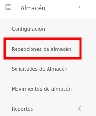
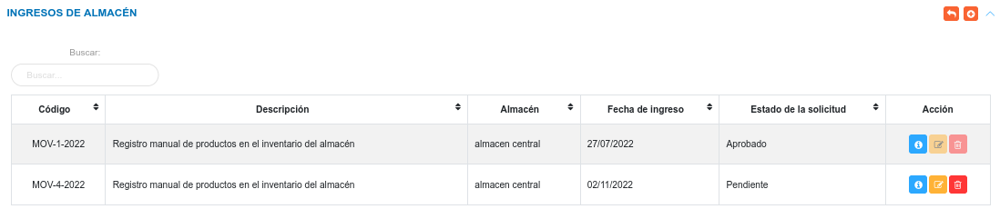
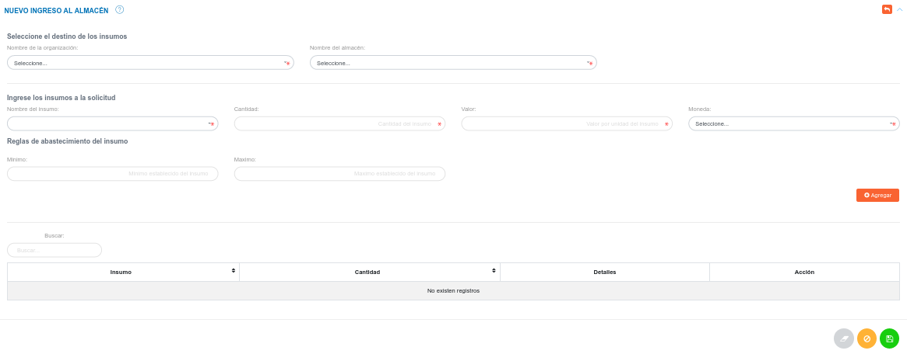
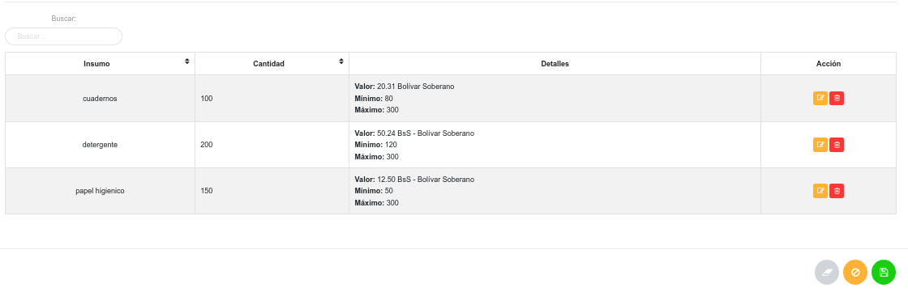
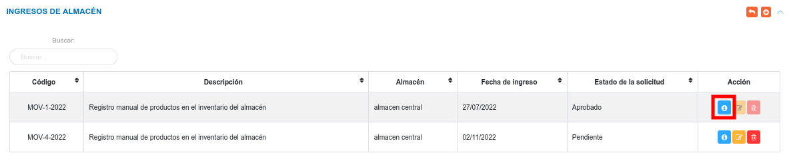
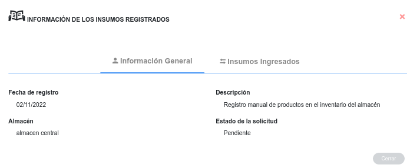
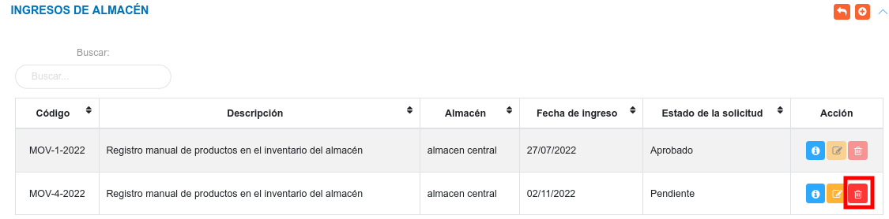
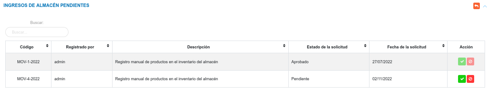

# Gestión de Recepción e Ingreso de Artículos 
*********************************************

## Ingresos de almacén 

Para acceder a esta funcionalidad, el usuario se dirige al menú lateral y se ubica en el módulo de almacén, luego debe pulsar la opción **Recepciones de almacén**, seguidamente el sistema muestra el panel central compuesta por las secciones **Ingresos de Almacén** e **Ingresos de Almacén Pendientes**.

Figura: Ingresos de Almacén

En la sección **Ingresos de Almacén**, el sistema lista los registros asociados a los  ingresos de artículos de almacén. También, mediante  esta sección es posible crear una nuevo registro, ver información detallada del registro, editar y eliminar un registro. 

Esta tabla de registros presenta las columnas:  código, descripción, almacén, fecha de ingreso y estado de la solicitud. 

Figura: Ingresos de Almacén

### Crear un nuevo ingreso de almacén

Esta funcionalidad permite registrar un nuevo ingreso de productos, es importante saber que los productos deben estar registrados previamente al igual que los almacenes,	de no estar registrados es necesario ir a la configuración del módulo para ingresar esta información. 

**Para crear un nuevo registro**

- Haciendo uso del botón **Crear** 
ubicado en la esquina superior derecha de esta sección, se procede a realizar una nueva solicitud.
- Se completa el formulario de registro de la sección **Nuevo Ingreso al Almacén**.
- Se agregan los productos a ingresar a la solicitud. 
- Se presiona el botón **Guardar**  ubicado al final de esta sección, y se verifica en la lista de registros en **Ingresos de Almacén**.
- Se Presiona el botón **Cancelar**   para cancelar registro y regresar a la ruta anterior.
- Se Presiona el botón **Borrar**  para eliminar datos del formulario.
- Si desea recibir ayuda guiada presione el botón .
- Para retornar a la ruta anterior presione el botón .

Figura: Nuevo Ingreso al Almacén

!!! note "Nota"
	Los tipos de moneda son registrados inicialmente en la **Configuración General** del Sistema KAVAC, específicamente en la opción "Monedas" de la sección de "Registros Comunes".
	
!!! info "Información"
	En el formulario de registro de la sección **Nuevo Ingreso al Almacén** es posible agregar todos los productos deseados, a través del botón:

	

	Cada producto agregado se muestra en un tabla de registros, en la parte inferior de dicha sección.

Figura: Productos Agregados

Los productos que han sido agregados pueden ser editados o eliminados, a través de los botones ubicados en la columna titulada **Acción** de la tabla de **Productos Agregados**.  

### Gestión de registros

Para **Ver información detallada**, **Editar** o **Eliminar** un registro se debe hacer uso de los botones ubicados en la columna titulada **Acción** de la tabla de registros en la sección de **Ingresos de Almacén**.  

#### Consultar registros

- Presione el botón **Consultar registro**  para un registro de interés. 

Figura: Consultar registros de ingresos de almacén 

- Seguidamente, el sistema muestra una interfaz con la información ingresada previamente del registro de almacén.

Figura: Datos del registro de almacén

#### Editar registros

- Presione el botón **Editar registro**  para un registro de interés.
- Luego, el sistema muestra el formulario en forma de edición.
- Modifique la información que requiera.
- Presione el botón **Guardar**   para registrar los cambios efectuados.

#### Eliminar registros

- Presione el botón **Eliminar**   para un registro de interés.

Figura: Eliminar Registros de ingreso de almacén

- Seguidamente, el sistema presenta un modal con un mensaje de confirmación de si está seguro de eliminar el ingreso de almacén, y muestra los botones Confirmar y Cancelar.
- Pulse el botón **Confirmar** si está seguro de eliminar el registro seleccionado.
- El sistema elimina el registro.
- Si pulsa el botón **Cancelar**, el sistema no ejecuta ninguna acción. 

## Ingresos de almacén pendientes

En esta sección, el sistema lista los registros de ingresos de almacén que el usuario realice, y estos toman el estado **Pendiente**, luego puede cambiar el estado como **Rechazado**, **Aprobado** o **Entregado** dependiendo de la acción que realice el analista de almacén.

Desde esta sección el analista de almacén o el usuario con permisos especiales sobre el módulo de almacén, puede Aceptar o Rechazar los ingresos que se encuentran en el estado Pendiente.

Figura: Ingresos de Almacén Pendientes

Para  **Aceptar** o **Rechazar** un registro se debe hacer uso de los botones ubicados en la columna titulada **Acción** de la tabla de registros en la sección de **Ingresos de Almacén Pendientes**.

### Aceptar solicitud

- Dirigirse al módulo de **Almacén**. 
- Ingresar en **Recepciones de Almacén**.
- Ubicarse en la sección **Ingresos de Almacén Pendientes**. 
- Haciendo uso del botón **Aceptar** 
ubicado en la columna titulada **Acción** de la tabla de registros se aprueba la solicitud.

### Rechazar solicitud

- Dirigirse al módulo de **Almacén**. 
- Ingresar en **Recepciones de Almacén**.
- Ubicarse en la sección **Ingresos de Almacén Pendientes**. 
- Haciendo uso del botón **Rechazar** 
ubicado en la columna titulada **Acción** de la tabla de registros se rechaza la solicitud.

   