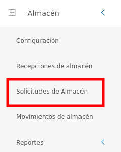
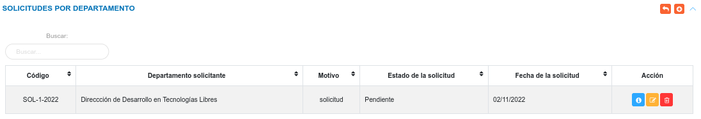
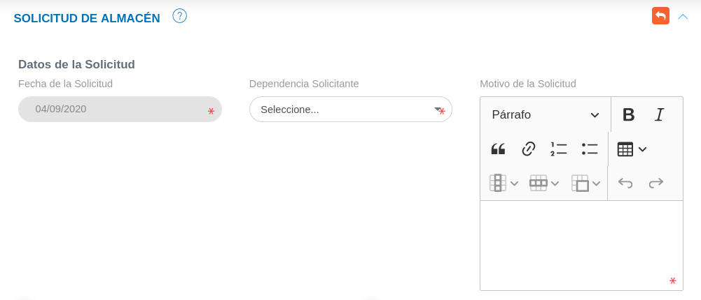
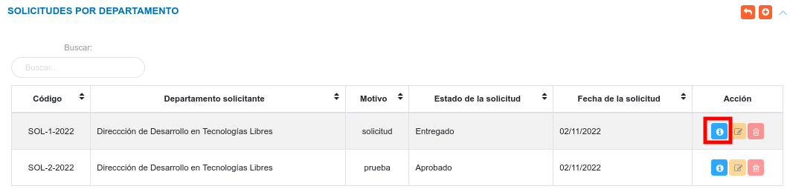
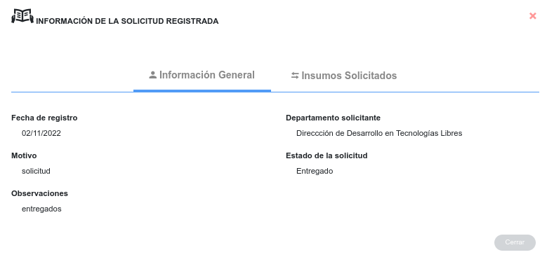
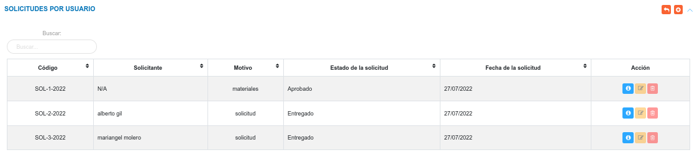
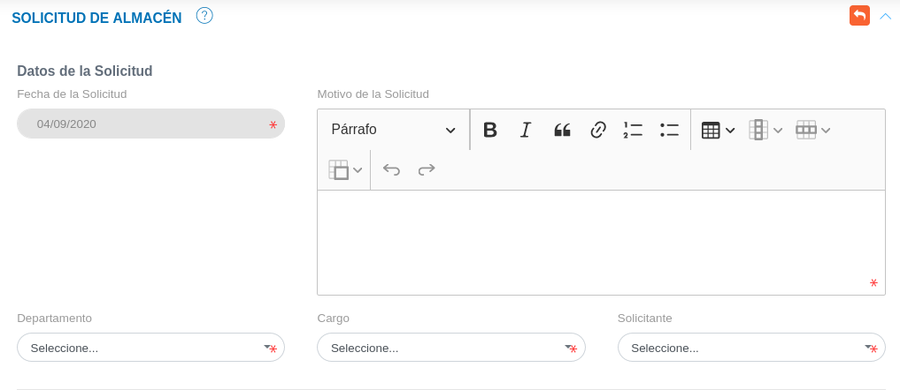
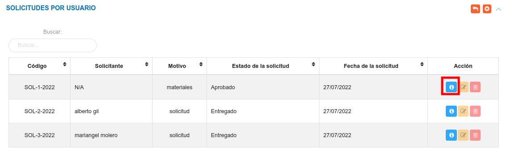
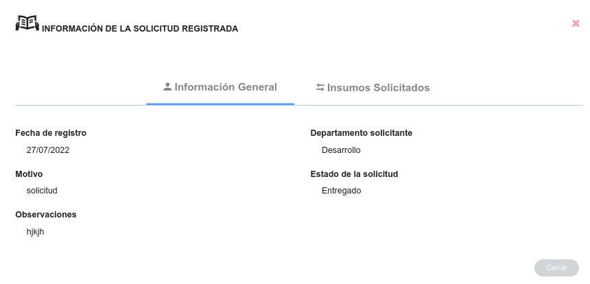
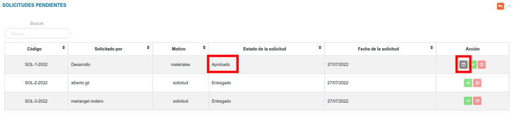

# Gestión de Solicitudes  de Almacén
*************************************

## Solicitudes de Almacén

Esta funcionalidad le permite al usuario realizar dos tipo de solicitudes: solicitudes por departamento y solicitudes por usuario. Para ingresar a esta sección, el usuario se debe diririgir al menú lateral, luego ubicarse en el módulo de almacén y pulsar la opción solicitudes de almacén.

Figura: Solicitudes de almacén

### Solicitudes por departamento

Una vez que el usuario pulse la opción **Solicitudes de Almacén**, el sistema muestra un panel cental con las secciones: Solicitudes por Departamento, Solicitudes por Usuario y Solicitudes Pendientes. 

En la sección de Solicitudes por Departamento, el sistema muestra una tabla de registros que lista las solicitudes de artículos o materiales que un departamento o dependencia requiere, desde esta sección también es posible **Crear** una nueva solicitud, **Ver**, **Editar** y **Eliminar** un registro. 

Figura: Solicitudes por Departamento

#### Crear una nueva solicitud por departamento

Esta funcionalidad permite registrar una nueva solicitud para productos o artículos que son requeridos por un departamento o dependencia.

**Para crear una nueva solicitud**

- Dirigirse al módulo de **Almacén**, luego a **Solicitudes de Almacén** y ubicarse en la sección **Solicitudes por Departamento**.
- Haciendo uso del botón **Crear** 
ubicado en la esquina superior derecha de esta sección, se procede a realizar una nueva solicitud.
- Se completa el formulario de registro de la sección **Solicitud de Almacén**. 
- Se presiona el botón **Guardar**  ubicado al final de esta sección, y se verifica en la lista de registros en **Solicitudes por Departamento**.
- Se Presiona el botón **Cancelar**   para cancelar registro y regresar a la ruta anterior.
- Se Presiona el botón **Borrar**  para eliminar datos del formulario.
- Si desea recibir ayuda guiada presione el botón .
- Para retornar a la ruta anterior presione el botón .

Figura: Solicitud de Almacén-Departamento

#### Sobre los datos de la solicitud

**Dependencia solicitante**

!!! note "Nota"
	Los datos correspondientes al campo Dependencia Solicitante (departamento), deben estar registrados previamente, de no estar registrados es necesario adjuntar esta información en la Configuración General del Sistema KAVAC, específicamente en la opción "Unidades/Dependencias" de la sección de "Registros Comunes".

**Proyecto y Acción Centralizada**
	
Si la solicitud se encuentra relacionada directamente con un **Proyecto** cambie el botón de selección a la opción **SI** e ingrese un **Proyecto** y **Acción Específica** (asegurese de que exista al menos una **Acción Específica** asociada al **Proyecto**). 

Figura: Solicitud de Almacén-Proyecto

Si la solicitud se encuentra relacionada directamente con una **Acción Centralizada** cambie el botón de selección a la opción **SI** e ingrese una **Acción Centralizada** y **Acción Específica** (asegurese de que exista al menos una **Acción Específica** asociada a la **Acción Centralizada**).

Figura: Solicitud de Almacén-Acción Centralizada

	
!!! note "Nota"
	Los datos correspondientes al campo Proyecto, Acción Específica y Acción Centralizada, deben estar registrados previamente, de no estar registrados es necesario adjuntar esta información en la Configuración del módulo de Presupuesto. 

**Seleccionar artículos a solicitar**

Seleccione los artículos a solicitar usando el botón Checkbox ubicado en la primera columna de la tabla de artículos y a través del campo ubicado en la columna titulada **Solicitados** indique el número de artículos a solicitar. 

Figura: Selección de Artículos

!!! warning "Advertencia"
	El número de artículos a solicitar debe ser menor o igual al número de artículos en Existencia

#### Gestión de registros

Para **Ver información detallada**, **Editar** o **Eliminar** un registro se debe hacer uso de los botones ubicados en la columna titulada **Acción** de la tabla de registros en la sección de **Solicitudes por Departamento**.  

#### Consultar registros

- Presione el botón **Consultar registro**  para un registro de interés. 

Figura: Consultar registro de solicitudes por departamento

- Seguidamente, el sistema muestra una interfaz con la información ingresada previamente del registro de la solicitud por departamento.

Figura: Datos del registro de solicitudes por departamento

#### Editar registros

- Presione el botón **Editar registro**  para un registro de interés.
- Luego, el sistema muestra el formulario en forma de edición.
- Modifique la información que requiera.
- Presione el botón **Guardar**   para registrar los cambios efectuados.

#### Eliminar registros

- Presione el botón **Eliminar**   para un registro de interés.
- Seguidamente, el sistema presenta un modal con un mensaje de confirmación de si está seguro de eliminar el registro de la solicitud por departamento, y muestra los botones Confirmar y Cancelar.
- Pulse el botón **Confirmar** si está seguro de eliminar el registro seleccionado.
- El sistema elimina el registro.
- Si pulsa el botón **Cancelar**, el sistema no ejecuta ninguna acción. 

### Solicitudes por usuario

Una vez que el usuario pulse la opción **Solicitudes de Almacén**, el sistema muestra un panel cental con las secciones: Solicitudes por Departamento, Solicitudes por Usuario y Solicitudes Pendientes.

En la sección Solicitudes por Usuario, el sistema lista las solicitudes de artículos o materiales que un usuario requiere, desde esta sección es posible **Crear** una nueva solicitud, **Ver**, **Editar** y **Eliminar** un registro. 

Figura: Solicitudes por Usuario

#### Crear una nueva solicitud por usuario

Esta funcionalidad permite registrar una nueva solicitud de productos o artículos que son requeridos por un usuario.

**Para crear una nueva solicitud**

- Dirigirse al módulo de **Almacén**, luego a **Solicitudes de Almacén** y ubicarse en la sección **Solicitudes por Usuario**.
- Haciendo uso del botón **Crear** 
ubicado en la esquina superior derecha de esta sección, se procede a realizar una nueva solicitud.
- Se completa el formulario de registro de la sección **Solicitud de Almacén**. 
- Se presiona el botón **Guardar**  ubicado al final de la sección y se verifica en la lista de registros de la sección **Solicitudes por Usuario**.
- Se Presiona el botón **Cancelar**   para cancelar registro y regresar a la ruta anterior.
- Se Presiona el botón **Borrar**  para eliminar datos del formulario.
- Si desea recibir ayuda guiada presione el botón .
- Para retornar a la ruta anterior presione el botón .

Figura: Solicitud de Almacén-Usuario

#### Sobre los datos de la solicitud

**Departamento**

!!! note "Nota"
	Los datos correspondientes al campo Departamento, deben estar registrados previamente, de no estar registrados es necesario adjuntar esta información en la Configuración General del Sistema KAVAC, específicamente en la opción "Unidades/Dependencias" de la sección de "Registros Comunes".

**Cargo y Solicitante**
	
!!! note "Nota"
	Los usuarios solicitantes deben estar registrados previamente en el expediente del módulo de Talento Humano.

**Seleccionar artículos a solicitar**

Seleccione los artículos a solicitar usando el botón Checkbox ubicado en la primera columna de la tabla de artículos y a través del campo ubicado en la columna titulada **Solicitados** indique el número de artículos a solicitar. 

Figura: Selección de Artículos

!!! warning "Advertencia"
	El número de artículos a solicitar debe ser menor o igual al número de artículos en Existencia

#### Gestión de registros

Para **Ver información detallada**, **Editar** o **Eliminar** un registro se debe hacer uso de los botones ubicados en la columna titulada **Acción** de la tabla de registros en la sección de **Solicitudes por Usuario**.  

#### Consultar registros

- Presione el botón **Consultar registro**  para un registro de interés. 

Figura: Consultar registro de solicitudes por usuario

- Seguidamente, el sistema muestra una interfaz con la información ingresada previamente del registro de almacén.

Figura: Datos del registro de solicitudes por usuario

#### Editar registros

- Presione el botón **Editar registro**  para un registro de interés.
- Luego, el sistema muestra el formulario en forma de edición.
- Modifique la información que requiera.
- Presione el botón **Guardar**   para registrar los cambios efectuados.

#### Eliminar registros

- Presione el botón **Eliminar**   para un registro de interés.
- Seguidamente, el sistema presenta un modal con un mensaje de confirmación de si está seguro de eliminar el registro de la solicitud por usuario, y muestra los botones Confirmar y Cancelar.
- Pulse el botón **Confirmar** si está seguro de eliminar el registro seleccionado.
- El sistema elimina el registro.
- Si pulsa el botón **Cancelar**, el sistema no ejecuta ninguna acción. 

!!! warning "Advertencia"
	El usuario encargo de la gestión de almacén debe ser cuidadoso a la hora de registrar y aprobar solicitudes, ya que debe tomar en consideración el número de existencia y el número de reserva que el insumo tiene asignado.  Si se excede en el número de reservas generadas por solicitud de acuerdo a la existencia del insumo el sistema generará un mensaje indicando el error. 

	

	**Consultar número de reserva y existencia del producto**

	Una vez se ingresa al formulario de **Solicitud de Almacén** para una solicitud por **Departamento** o por **Usuario**, cada **Insumo** indica información sobre su existencia y reserva en la columna titulada **Inventario**.

	

### Solicitudes pendientes 

Una vez que el usuario pulse la opción **Solicitudes de Almacén**, el sistema muestra un panel cental con las secciones: Solicitudes por Departamento, Solicitudes por Usuario y Solicitudes Pendientes.

En la sección solicitudes pendites, el sistema lista los registros de solicitudes por departamento o por usuario que el usuario realice, y esta toma el estado **Pendiente**, luego puede cambiar el estado como **Rechazado**, **Aprobado** o **Entregado** dependiendo de la acción que realice el analista de almacén. 

Desde esta sección el analista del módulo de almacén o el usuario con permisos especiales, puede **Aceptar** o **Rechazar** solicitudes que se encuentran en el estado **Pendiente**.

Figura: Solicitudes Pendientes

 
Para **Aceptar** o **Rechazar** una solicitud se debe hacer uso de los botones ubicados en la columna titulada **Acción** de la tabla de registros en la sección **Solicitudes Pendientes**.

#### Aceptar solicitud

- Dirigirse al módulo de **Almacén**. 
- Ingresar a **Solicitudes de Almacén**.
- Ubicarse en la sección **Solicitudes Pendientes**. 
- Haciendo uso del botón Aceptar 
ubicado en la columna titulada **Acción** de la tabla de registros se aprueba la solicitud seleccionada.

#### Rechazar solicitud

- Dirigirse al módulo de **Almacén**. 
- Ingresar en **Solicitudes de Almacén**.
- Ubicarse en la sección **Solicitudes Pendientes**.
- Haciendo uso del botón **Rechazar** 
ubicado en la columna titulada **Acción** de la tabla de registros se rechaza la solicitud seleccionada

#### Entregar productos 

Una vez la solicitud que el usuario apruebe una solicitud, y el artículo se encuentra disponible se habilita la opción **Entregar Producto** en la columna títulada **Acción**. 

Figura: Solicitudes Pendientes

#### Para confirmar la Entrega de productos

- Dirigirse al módulo de **Almacén**. 
- Ingresar a **Solicitudes de Almacén**.
- Ubicarse en la sección **Solicitudes Pendientes**. 
- Presionar el botón **Entregar** 
ubicado en la columna titulada **Acción** de la tabla de solicitudes.
- Ingresar una observación y presionar el botón **Guardar** para confirmar entrega. 

Figura: Solicitudes Pendientes

Luego que la entrega ha sido confirmada la solicitud cambia su estado a **Entregado** en la tabla de **Solicitudes por Departamento** o **Solicitudes por Usuario** según sea el caso.

Figura: Estado de Solicitud-Entregado

   