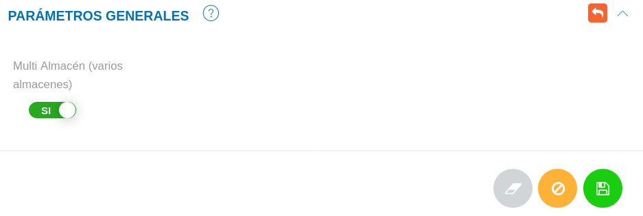

# Configuración Módulo de Almacén
********************************

## Parámetros generales

Esta sección cuenta con el botón denominado Multi Almacén, si el usuario lo activa, el sistema inmediatamente habilita en el menú lateral la funcionalidad de movimientos de almacén. 

Figura: Parámetros Generales

**Para activar la opción Multi Almacén**

- Dirigirse a la **Configuración** del módulo de **Almacén**.
- Ubicarse en **Parámetros Generales**. 
- Activar la opción **Multi Almacén** a través del botón de selección. 
- Presionar el botón **Guardar**  y verifica que se haya habilitado en el panel lateral izquierdo la opción  de movimientos de almacén.
- Se Presiona el botón **Cancelar**   para cancelar registro y regresar a la ruta anterior.
- Se Presiona el botón **Borrar**  para eliminar datos del formulario.
- Si desea recibir ayuda guiada presione el botón .
- Para retornar a la ruta anterior presione el botón .