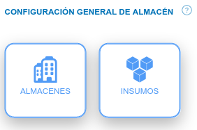
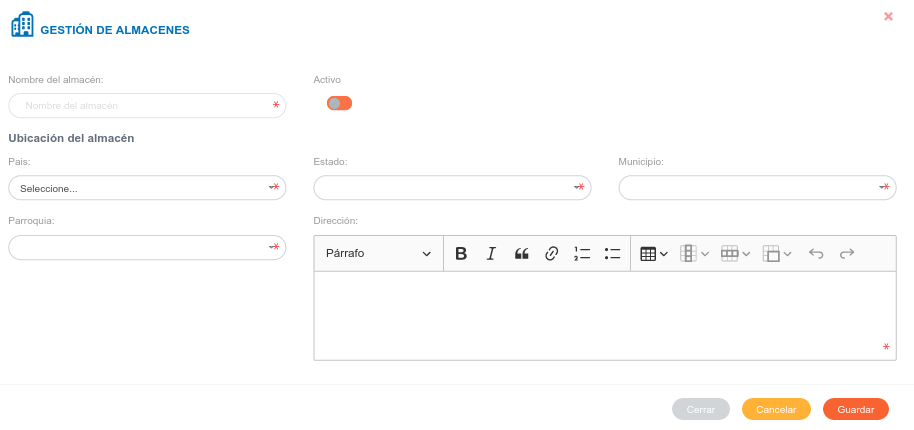
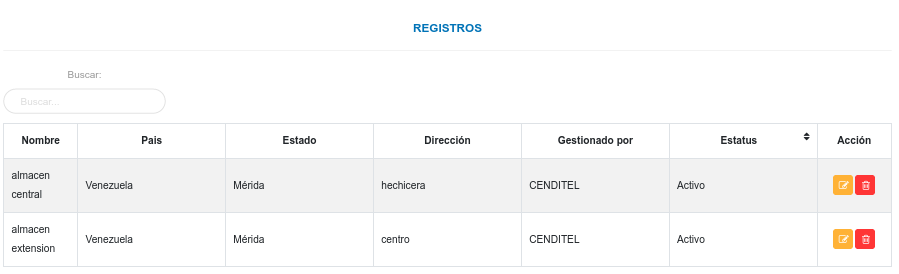
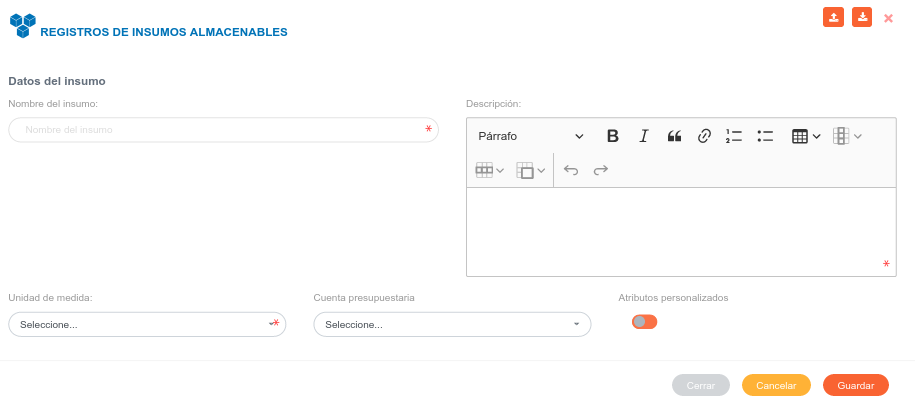
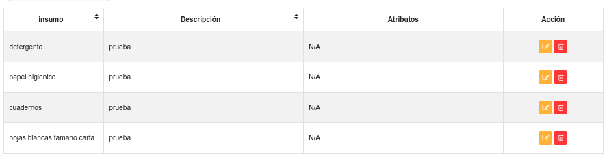

# Configuración Módulo de Almacén
********************************

## Configuración general de almacén 

En esta sección se realizan los registros iniciales de almacenes e insumos del módulo de almacén, registros que serán usados posteriormente en las secciones del módulo según la configuración que se realice.	De igual forma se pueden realizar ajustes sobre los datos ya existentes.  

Configuración General de Almacén 

### Almacenes

Desde esta sección se realiza la gestión de almacenes, esta opción permite registrar un nuevo almacén, editar o eliminar algún registro.

#### Crear un nuevo registro 

- Dirigirse a la **Configuración** del módulo de **Almacén**.
- Ingresar a **Almacenes** en la sección **Configuración General de Almacén**.
- Completar el formulario **Gestión de Almacenes **.   
- Presione el botón  **Guardar** para registrar los cambios efectuados.
- Presione el botón  **Cancelar** para limpiar datos del formulario.
- Presione el botón  **Cerrar** para cerrar el formulario.

Figura: Almacenes

Figura: Registros de Almacenes

#### Gestión de registros  

Mediante los botones ubicados en la columna titulada Acción de la tabla de registros, es posible  Editar o Eliminar un registro.

#### Editar registros

- Presione el botón **Editar registro**  para un registro de interés.
- Luego, el sistema muestra el formulario en forma de edición.
- Modifique la información que requiera.
- Presione el botón **Guardar**   para registrar los cambios efectuados.

#### Eliminar registros

- Presione el botón **Eliminar**   para un registro de interés.
- Seguidamente, el sistema presenta un modal con un mensaje de confirmación de si está seguro de eliminar el ingreso de almacén, y muestra los botones Confirmar y Cancelar.
- Pulse el botón **Confirmar** si está seguro de eliminar el registro seleccionado.
- El sistema elimina el registro.
- Si pulsa el botón **Cancelar**, el sistema no ejecuta ninguna acción. 

### Insumos

Desde esta sección  es posible realizar un nuevo registro, editar o eliminar algún registro existente.

#### Crear un nuevo registro de forma manual

- Dirigirse a la **Configuración** del módulo de **Almacén**.
- Ingresar a **Insumos** en la sección **Configuración General de Almacén**.
- Completar el formulario **Registros de Insumos Almacenables**.   
- Presione el botón  **Guardar** para registrar los cambios efectuados.
- Presione el botón  **Cancelar** para limpiar datos del formulario.
- Presione el botón  **Cerrar** para cerrar el formulario.

Figura: Formulario de Registro para Insumos Almacenables

Figura: Tabla de registros de insumos

#### Gestión de registros

Para **Editar** o **Eliminar** un registro se debe hacer uso de los botones ubicados en la columna titulada **Acción** de la tabla de Registros.

#### Editar registros

- Presione el botón **Editar registro**  para un registro de interés.
- Luego, el sistema muestra el formulario en forma de edición.
- Modifique la información que requiera.
- Presione el botón **Guardar**   para registrar los cambios efectuados.

#### Eliminar registros

- Presione el botón **Eliminar**   para un registro de interés.
- Seguidamente, el sistema presenta un modal con un mensaje de confirmación de si está seguro de eliminar el ingreso de almacén, y muestra los botones Confirmar y Cancelar.
- Pulse el botón **Confirmar** si está seguro de eliminar el registro seleccionado.
- El sistema elimina el registro.
- Si pulsa el botón **Cancelar**, el sistema no ejecuta ninguna acción. 

#### Importar registros

Mediante esta funcionalidad es posible cargar los registros de insumos de forma masiva mediante una hoja de cálculo. Se sugiere que al momento de realizar una importación de registros, se sigan las recomendaciones que se señalan en esté manual para la funcionalidad importar registros.

**Funcionalidad para importar registros**

Esta funcionalidad permite cargar los registros de insumos de forma masiva mediante  una hoja de cálculo. Se sugiere que al momento de realizar una importación de registros, se sigan las recomendaciones que se señalan en esté manual para la funcionalidad importar registros.

Se recomienda al usuario que va a importar un archivo, que primero realice una exportación de los registros (registros de insumos) que se encuentran en el sistema. Esto le permite al usuario editar esta copia del archivo de registros y usar esta información para realizar una importación. 

El formato de hoja de calculo establecido en el archivo a importar contiene una serie de columnas el cual deben estar identificadas, si el usuario ha exportado un archivo entonces este mantiene sus columnas identificadas por defecto y no es necesario cambiar algún valor.

Cada uno de los campos asociados a cada registro se encuentran identificados por un id el cual es un identificador único.

A continuación se muestra una tabla de registros con sus respectivos id. Para un nuevo registro basta solo con que el usuario complete los campos name (nombre del producto), description (descripción del producto) y measurement_unit_id (id de la unidad de medida); entonces el sistema completa de forma automática los campos faltantes. 

Los id son generados cada vez que se realiza un nuevo registro en la configuración del módulo, es posible visualizarlos una vez se exporte un archivo de registros (registros de productos) desde el sistema. 

El archivo que el usuario ha exportado le permite editar esta información, es decir, puede actualizar cualquier registro que se ha realizado previamente. Sin embargo, el manejo de este contenido se debe realizar con precaución, ya que los registros pueden encontrase asociados a través de sus id. 
  

**Tabla de registros de productos**

|name|description|measurement_unit_id|measurement_unit|measurement_unit_acronym|measurement_unit_description| 
|--|--|--|--|--|--|
|Producto 1|Descripción|1|Bulto|bulto|Descripción de unidad de medida|
|Producto 2|Descripción|2|Caja|caja|Descripción de unidad de medida|
|Producto 3|Descripción|3|Galón|gal|Descripción de unidad de medida|
|Producto 4|Descripción|4|Litro|lts|Descripción de unidad de medida|
|Producto 5|Descripción|5|Metros cuadrados|mt2|Descripción de unidad de medida|
|Producto 6|Descripción|6|Metros lineales|m|Descripción de unidad de medida|
|Producto 7|Descripción|7|Paquete|pkg|Descripción de unidad de medida|
|Producto 8|Descripción|8|Quintal|qq|Descripción de unidad de medida|
|Producto 9|Descripción|9|Resma|res|Descripción de unidad de medida|
|Producto 10|Descripción|10|Servicio|srv|Descripción de unidad de medida|
|Producto 11|Descripción|11|Unidad|und|Descripción de unidad de medida|

!!! note "Nota"
	Las unidades de medida son registradas inicialmente en la **Configuración General del Sistema KAVAC**.

!!! warning "Advertencia"
	Los formatos permitidos para la carga de archivos son:  **csv**, **xls**, **xlsx** y **ods**.  

**Para importar registros**

- Dirigirse a la **Configuración del módulo de Almacén**.
- Ingresar a **Insumos** en la sección **Configuración General de Almacén**.
- Presionar el botón **Importar**  ubicado en la esquina superior derecha de esta sección.  
- Seleccionar el archivo del directorio local, para transferir a la aplicación.  
- Verificar que los registros se hayan almacenado en la lista de registros recargando la página.  

#### Exportar registros

Mediante esta funcionalidad es posible obtener una copia de todos los registros a tráves de una hoja de cálculo.

**Para exportar registros**

- Dirigirse a la **Configuración** del módulo de **Almacén**.
- Ingresar a **Insumos** en la sección **Configuración General de Almacén**.
- Presionar el botón **Exportar**  ubicado en la esquina superior derecha de esta sección.  
- Una copia del archivo se transfiere de la aplicación al equipo, este archivo contiene todos los registros de productos almacenados en el sistema.  

